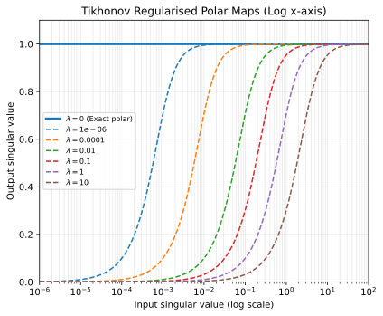
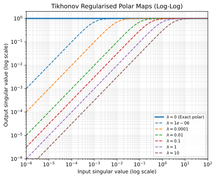
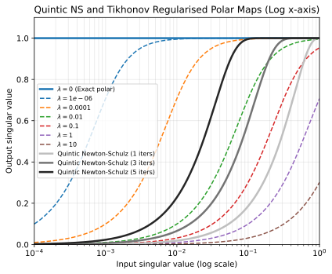
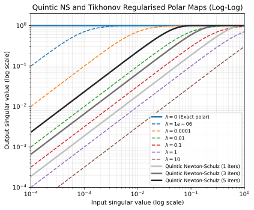
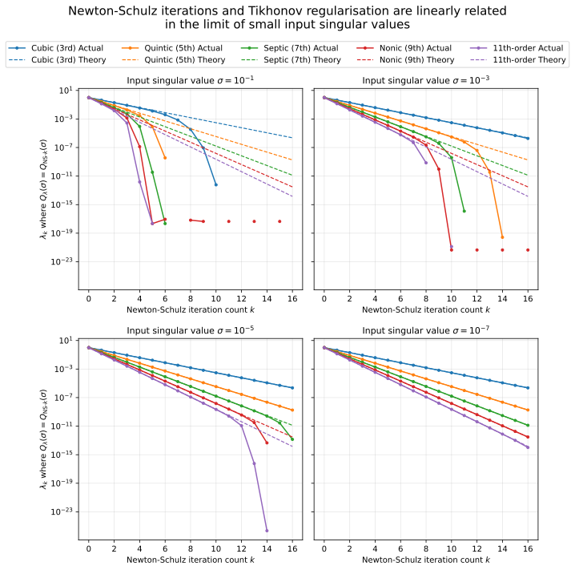
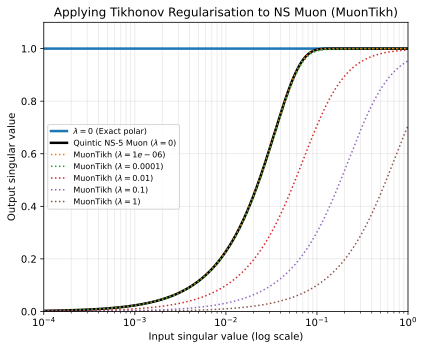
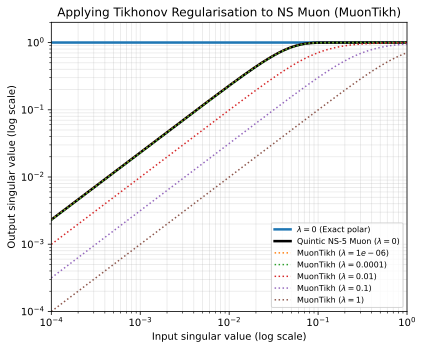

## Muon and the polar map
Muon (Jordan et al. 2024) is a matrix-aware optimiser for neural networks. Conceptually, it seeks to apply the polar map to the gradient $G \in \mathbb{R}^{n \times m}$ of each weight matrix:
$$Q(G) = (GG^T)^{-\frac{1}{2}}G.$$

This is known as "orthogonalising" the gradient, since it sets all singular values to 1. If $G = U \Sigma V^T$ is the singular value decomposition of $G$, then
$$\begin{align*}
Q(G) &= (U \Sigma^2 U^T)^{-\frac{1}{2}} U \Sigma V^T \\
&= U \Sigma^{-1} U^T U \Sigma V^T \\
&= U V^T.
\end{align*}$$

The typical motivation for Muon is that it is equivalent to performing steepest descent under a spectral norm step-size constraint, which therefore utilises a geometry which treats the weight matrix as a linear map rather than a flattened vector. Since the spectral norm of the update is 1, this also bounds the change in the output activations, which seems intuitively desirable.

Since computing the exact polar map is expensive, Muon uses a Newton-Schulz iteration to compute an approximation to the polar map. The Newton-Schulz iteration derives its name from using a step of Newton's method to approximate the polar map, and then using a separate Newton iteration to approximate the matrix inverse inside that step (proposed by Schulz, 1933) (for more details, see e.g. Higham, 2008, Chapter 8). However, the Newton-Schulz iteration is much simpler to understand by just viewing it as applying odd polynomials to the gradient singular values. For example, consider the quintic polynomial
$$ p(X) = \frac{15}{8}X - \frac{5}{4}(XX^T)X + \frac{3}{8}(XX^T)^2X.$$
By cancellation of the orthogonal matrices in the SVD, and grouping like terms, we have
$$p(G) = U p(\Sigma) V^T,$$
and since $\Sigma$ is diagonal, $p(\Sigma)$ just applies the quintic polynomial to each singular value. This works for any odd polynomial of this form, and so to approximate the polar map, we just need to find polynomials which converge quickly to the step function when applied repeatedly. Indeed, much of the literature on Muon focuses on finding odd polynomial iterations which converge very quickly to the polar map (you don't need to use the same polynomial each iteration either, e.g. Polar Express, Amsel et al. 2025). The Newton-Schulz polar map using polynomial $p$ and $K$ iterations takes the form
$$Q_{\text{NS-}K}(G) = p^{\circ K}(G) = \underbrace{p \circ \cdots \circ p}_{K \text{ times}}(G).$$

Muon has been shown to beat AdamW in LLM pretraining (Wen et al. 2025) and is now being adopted in large LLM training regimes (e.g. Kimi K2, DeepSeek-V4). It is not entirely clear why Muon works so well. One hypothesis is that promoting small singular values to 1 ensures that singular directions with small gradients receive a larger update, which may be important if they contain valuable information. However, **we hypothesise that, in some settings, small singular values may be dominated by noise, and promoting them may in fact be harmful** (*author's note: as of June 2026, we are still in search of some compelling empirical evidence for this, hence why this is not yet a paper...*). It is therefore natural to consider approximations to the polar map which filter out small singular values.

Recent work (Pion, Fan et al. 2026) has also considered this question, and proposed using a separate Newton-Schulz polynomial to suppress small singular values. However, we suggest that **Newton-Schulz is already applying a high-pass filter in the form of Tikhonov regularisation in the polar map, which may be beneficial**, and that **extra Tikhonov regularisation can be manually added to Muon when using Gram Newton-Schulz with no additional complexity or computational overhead**. 

<hr>

## Tikhonov regularised polar map

We define the Tikhonov regularised polar map as
$$Q_\lambda(G) = (GG^T + \lambda I)^{-\frac{1}{2}}G.$$

Substituting the SVD of $G$ into this, we have
$$\begin{align*}
Q_\lambda(G) &= (U \Sigma^2 U^T + \lambda I)^{-\frac{1}{2}} U \Sigma V^T \\
&= (U (\Sigma^2 + \lambda I) U^T)^{-\frac{1}{2}} U \Sigma V^T \\
&= U (\Sigma^2 + \lambda I)^{-\frac{1}{2}} U^T U \Sigma V^T \\
&= U (\Sigma^2 + \lambda I)^{-\frac{1}{2}} \Sigma V^T\\
&= U \text{diag}\left(\frac{\sigma_i}{\sqrt{\sigma_i^2 + \lambda}}\right) V^T
\end{align*}$$
where the last step follows from the fact that $\Sigma^2 + \lambda I$ and $\Sigma$ are diagonal, with $\Sigma_{ii} = \sigma_i$. One can see that when $\sigma_i^2 \gg \lambda$, the Tikhonov regularised polar map behaves like the standard polar map, since $\frac{\sigma_i}{\sqrt{\sigma_i^2 + \lambda}} \approx 1$. However, when $\sigma_i^2 \ll \lambda$, the Tikhonov regularised polar map doesn't significantly promote the singular value, since $\frac{\sigma_i}{\sqrt{\sigma_i^2 + \lambda}} \approx \frac{\sigma_i}{\sqrt{\lambda}}$, therefore keeping $\sigma_i$ orders of magnitude smaller than 1.

We can plot the Tikhonov regularised polar map for different values of $\lambda$ to see how it behaves:


As expected, large singular values (relative to $\sqrt{\lambda}$) are promoted to 1 as usual, but small singular values remain small. Plotting this on a log-log scale gives straight lines with slope 1 for small singular values, confirming the linear behaviour when $\sigma_i^2 \ll \lambda$ (in the optimisation setting, this transformation would therefore revert to SGD for small singular values / large lambda). As we increase $\lambda$, the intercept of the curve shifts downwards, meaning more singular values are suppressed.


<hr>

## Newton-Schulz implicitly approximates the Tikhonov regularised polar map

We can plot the Newton-Schulz iteration (let's use the quintic polynomial from earlier, with 3 different numbers of iterations) on the same log-x plot as before to compare its effect on the singular values. This time, we only plot up to $x=1$ since we Frobenius normalise the gradient before applying the Newton-Schulz iteration, meaning all singular values are in the range (0, 1]:



Interestingly, the Newton-Schulz map has the same qualitative behaviour as the Tikhonov regularised polar map, suppressing small singular values with an "s" shape curve. Furthermore, increasing the number of iterations shifts the curve to the left, meaning more small singular values are promoted to 1, similar to decreasing $\lambda$. Plotting this on a log-log scale confirms that the Newton-Schulz iteration also behaves linearly for small singular values, with the intercept shifting upwards as we increase the number of iterations, again similar to decreasing $\lambda$:



This suggests a simple observation: **approximating the polar map with Newton-Schulz can be viewed as applying a soft high-pass filter through Tikhonov regularisation**. The reason is not complicated: in the limit of small singular values, both the Newton-Schulz map and the Tikhonov regularised polar map behave linearly. In mathematics, considering the behaviour of the maps on small singular values, we have
$$Q_\lambda(\sigma) = \frac{\sigma}{\sqrt{\sigma^2 + \lambda}} \approx \frac{\sigma}{\sqrt{\lambda}} \quad \text{as} \quad \sigma \to 0$$
and for Newton-Schulz with a general odd polynomial and $K$ iterations
$$Q_{\text{NS-}K}(\sigma) = p^{\circ K}(\sigma) \approx a^K\sigma \quad \text{where } p(x) = ax + bx^3 + cx^5 + \dots$$

Letting $Q_\lambda(\sigma) = Q_{\text{NS-}K}(\sigma)$ we can, for a particular value of $\sigma$ (which should be small), obtain the relationship
$$\lambda \approx \alpha^{-2K}$$
i.e. the effective amount of Tikhonov regularisation applied by the Newton-Schulz approximation decays exponentially with the number of iterations. We can verify this relationship empirically for a fixed sigma (below we test 4 different magnitudes) by plotting $\lambda$ as a function of $K$ (i.e. the point where the two curves intersect). We show the log-y linear-x scale plot below (where exponential decay is shown as a straight line), with multiple curves representing different order polynomials used in the Newton-Schulz procedure. Specifically, the polynomials are derived from the truncated Taylor series of the inverse square root function (health warning: ChatGPT maths; it's only a blogpost so I'm allowed). We see that the relationship holds more strongly for smaller values of $\sigma$, as expected. We also note that the relationship breaks down more quickly for higher order polynomials, since these more efficiently promote small singular values to 1. Indeed, the important takeaway is not the precise relationship between $\lambda$ and $K$, but rather the observation that inefficient orthogonalisation can be viewed as applying a high-pass filter on the inputs to the preconditioner.



<hr>

## Adding Tikhonov regularisation to Muon via Gram NS (MuonTikh?)

If we decide that the Tikhonov regularised polar map is desirable, the plots above suggest that discrete hyperparameters like the number of Newton-Schulz iterations or the polynomial schedule could be quite a coarse way to control $\lambda$. Ideally, we could specify $\lambda$ directly, and use the exact Tikhonov regularised polar map, but this is expensive to compute. Furthermore, the usual Newton-Schulz iteration directly approximates the polar map $(GG^T)^{-\frac{1}{2}}G$, and it is not clear how to insert the lambda term into the iteration. However, if we instead use Newton-Schulz to approximate the square root inverse of the Gram matrix $G^TG$, and then right-multiply by $G$ to get the preconditioner, we can easily insert the lambda term into the iteration by just adding $\lambda I$ to the Gram matrix. Fortunately, recent work on [Gram Newton-Schulz](https://dao-lab.ai/blog/2026/gram-newton-schulz/) (Zhang et al. 2026) has already developed an efficient method for doing this, and so inserting Tikhonov regularisation directly into Newton-Schulz Muon (or perhaps more accurately: approximating the Tikhonov regularised polar map with Newton-Schulz) can be done almost trivially (see the later paragraph about adjusting $\lambda$ based on the Frobenius normalisation) with no additional computational overhead. We also wonder (though we haven't tested this) whether added Tikhonov regularisation could alleviate the numerical issues that have been observed in Gram Newton-Schulz, therefore mitigating the need for the "restarts" they use.

Of course, as discussed above, Newton-Schulz already implicitly provides Tikhonov regularisation, so $\lambda$ may be too small to provide any additional effect. This can be seen if we plot the transfer functions for the proposed "use Newton-Schulz to approximate the Tikhonov regularised polar map", which we call "MuonTikh" for brevity and googleability:





There is an important adjustment to make when using MuonTikh on full matrices, instead of just single singular values: we usually normalise the gradient by its Frobenius norm before applying the Newton-Schulz iteration, which means that the singular values are always in the range (0, 1], which is ideal for Newton-Schulz, and it doesn't modify the target polar map since
$$Q(\alpha G) = (\alpha GG^T\alpha)^{-\frac{1}{2}} \alpha G = \alpha^{-1} \alpha Q(G) = Q(G).$$
where $\alpha = \frac{1}{\|G\|_F + \epsilon}$ in Muon implementations, for some small constant $\epsilon$. However, for the Tikhonov regularised polar map, we have
$$Q_\lambda(\alpha G) = (\alpha GG^T\alpha + \lambda I)^{-\frac{1}{2}} \alpha G = (GG^T + \frac{\lambda}{\alpha^2}I)^{-\frac{1}{2}} G = Q_{\frac{\lambda}{\alpha^2}}(G)$$
meaning our effective $\lambda$ is scaled by $\alpha^{-2}$, so to truly target the original $\lambda$, we must adjust the $\lambda$ inputted to MuonTikh by multiplying it by $\alpha^2$:
$$Q_{\lambda \alpha^2}(\alpha G) = Q_\lambda(G).$$

<hr>

## Connection to AdamW's Epsilon
To conclude this blogpost, we discuss what motivated this project in the first place. It has been repeatedly pointed out (e.g. Klioui 2026, Nado) that AdamW's epsilon term is often set to values far larger than makes sense as a simple numerical stabiliser, and in fact it should be thought of as a kind of trust region radius, which prevents AdamW's denominator from inflating gradients that are too small to 1. This is apparently useful in certain settings like reinforcement learning (see Nado's blogpost for an extensive list of works that use very large epsilon values). We wanted to know what the analogous quantity in Muon would be.

The Tikhonov regularisation mechanism we discuss in this blogpost is very similar: both mechanisms act as a trust region for the preconditioner, preventing it from boosting signals that are too small. One might suggest that the $\lambda$ parameter in the Tikhonov regularised polar map is analogous to AdamW's epsilon, and that tuning $\lambda$ could be just as important as tuning epsilon in AdamW (if that is indeed important — there seems to be a lot of anecdotal evidence, but I am not aware of any systematic study on this).

Side note: by setting $\lambda=1$ in MuonTikh, due to the previously discussed coupling between the Frobenius normalisation step and the effective Tikhonov regularisation, one can see that Muon's Frobenius normalisation $\epsilon$ can itself be used to control the effective Tikhonov regularisation, but this is much messier than controlling $\lambda$ directly.

So far, we have not been able to find any compelling empirical evidence that tuning $\lambda$ in Muon is particularly important. In fact, most of our preliminary experiments seemed to suggest the exact polar map (i.e. $\lambda = 0$) performs best, which therefore reinforces the idea that we should design Newton-Schulz iterations which converge as quickly as possible. However, the findings in settings like reinforcement learning and finetuning were not so clear-cut (noisy or ambiguous results), and may warrant further investigation.

<hr>

## Citing this blog post:

```bibtex
@article{muontikhblogpost,
  title={MuonTikh: Implicit and Explicit Tikhonov Regularisation in Muon},
  author={Milsom, Edward and Anson, Ben and Wang, Xi and Murray, Michael and Zhong, Wenzhi},
  year={2026},
  url={https://edwardmilsom.github.io/blog/muon_ns_tikhonov/}
}
```

<hr>

## References


Keller Jordan, Yuchen Jin, Vlado Boza, Jiacheng You, Franz Cesista, Laker Newhouse, & Jeremy Bernstein. (2024). Muon: An optimizer for hidden layers in neural networks.

Kaiyue Wen, David Hall, Tengyu Ma, & Percy Liang. (2025). Fantastic Pretraining Optimizers and Where to Find Them.

Kimi Team. (2025). Kimi K2: Open Agentic Intelligence.

DeepSeek-AI (2026). DeepSeek-V4: Towards Highly Efficient Million-Token Context Intelligence [White paper]. DeepSeek-AI.

Schulz, G. (1933). Iterative Berechung der reziproken Matrix. ZAMM - Journal of Applied Mathematics and Mechanics / Zeitschrift für Angewandte Mathematik und Mechanik, 13(1), 57-59.

Higham, N. (2008). Functions of Matrices. Society for Industrial and Applied Mathematics.

Noah Amsel, David Persson, Christopher Musco, & Robert M. Gower. (2025). The Polar Express: Optimal Matrix Sign Methods and Their Application to the Muon Algorithm.

Chongyu Fan, Gaowen Liu, Mingyi Hong, Ramana Rao Kompella, & Sijia Liu. (2026). Rethinking Muon Beyond Pretraining: Spectral Failures and High-Pass Remedies for VLA and RLVR.

Klioui, S. (2026). The Epsilon Trap: When Adam Stops Being Adam. Sifal Klioui Blog.

Nado, Z. (Year Unknown). $ε$, A Nuisance No More. Zack Nado Blog.

Jack Zhang, Noah Amsel, Berlin Chen, & Tri Dao. (2026). Gram Newton-Schulz.
